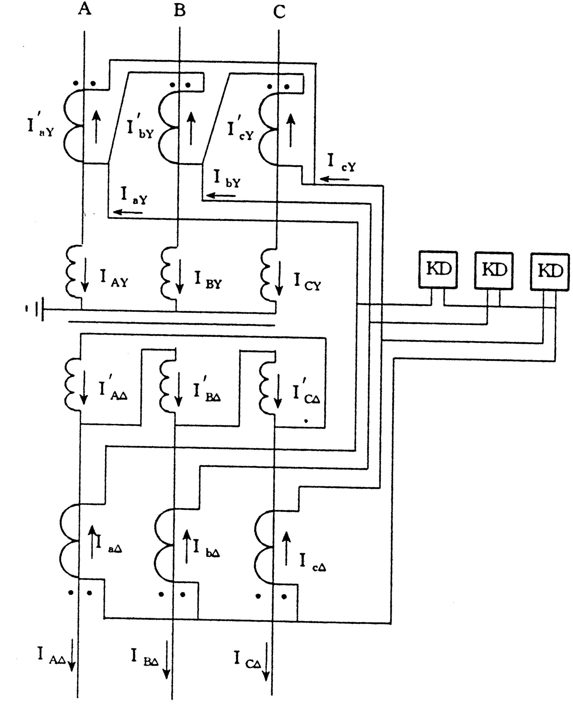

## 讨论课思考题

### 1. 试说明常见的基于单端电气量的保护原理有哪些？阐述它们是如何保证保护的选择性和灵敏性以及其在电力系统中的适用范围？

　　常见的单端电气量的保护原理包括过电流保护、零序电流保护和距离保护。由于它们的 Ⅰ 段均为瞬时速动但不能保护线路全长，为了能可靠切除故障同时又能保证保护的选择性，需要增加相应保护 Ⅱ 段与下条线路的相应Ⅰ段进行定值和时限的配合。保证了保护的选择性后，需要按照系统最小运行方式进行保护灵敏度校验，若灵敏度不满度要求，则需采取相应措施使之满足，比如过电流保护 Ⅱ 段灵敏度不满足要求时，可与相邻线路 Ⅱ 段配合，以提高灵敏度使之满足要求,但需要将时间再提高一级，以保护选择性。

　　适用范围：过电流保护一般用于 35kV 及以下电压等级配电网线路主保护，零序电流保护和距离保护一般用于 110kV 及以上电压等级电网的后备保护。

### 2. 讨论短路点过渡电阻对距离保护的影响及防止方法。

- **单侧电源网络：**单侧电源网络上，过渡电阻 $R_t$ 使继电器的测量阻抗值增大，阻抗角变小，保护范围缩小；有时也会导致保护无选择性动作。

  - 短路点距保护安装处越近，影响越大，反之影响越小；
  - 保护装置整定值越小，受过渡电阻影响越大。

  

- **双侧电源网络：**双侧电源线路上，过渡电阻与系统的短路电流有关，可能呈感性也可能呈容性，会使保护误动或拒动。一般而言，阻抗继电器动作特性在 $+R$ 轴方向上所占面积越大，受过渡电阻影响越小。

  

- **防止方法：**

  - 采用能容许较大的过渡电阻而不致拒动的阻抗继电器，可防止过渡电阻对继电器工作的影响。
  - 利用所谓瞬时测量回路来固定阻抗继电器的动作。

### 3. 零序电流保护灵敏 I 段和不灵敏 I 段保护的差别与使用条件是什么? 限时零序电流速断保护的灵敏系数不满足要求时所采取的措施是什么?

　　灵敏 I 段保护和不灵敏 I 段保护是分别按不同的原则进行整定，灵敏 I 段的整定值较小，保护范围较大，而不灵敏 I 段的整定值较大，保护范围较灵敏 I 段小些。

**使用条件：**

　　灵敏 I 段的主要任务是对全相运行状态下的接地故障起保护作用，具有较大的保护范围，而当单相自动重合闸起动时则将其自动闭锁，需待恢复全相运行时才能重新投入，即灵敏I段作为全相运行、发生接地故障时的接地保护，非全相运行时需退出运行；

　　不灵敏 I 段是在单相重合闸过程中，其他两相又发生接地故障时用以弥补失去灵敏 I 段的缺陷，尽快地将故障切除，即作为非全相运行、发生接地故障时的接地保护，不灵敏 I 段也能反应全相运行状态下的接地故障，只是其保护范围较灵敏 I 段小些。

**灵敏系数不满足要求时所采取的措施：**

　　使零序 Ⅱ 段保护与下一条线路的零序 Ⅱ 段相配合，时限再抬高一级，取为 0.7-1.2s ；

　　保留 0.5s 的零序 Ⅱ 段，同时再增加一个按躲过保护线路末端单相或两相接地短路时出现的最大零序电流整定的保护，这样保护装置中，就具有两个定值和时限均不相同的零序 Ⅱ 段。一个是定值较大，能在正常运行方式和最大运行方式下，以较短的延时切除本线路上所发生的大部分接地故障；另一个则具有较长的延时，它能保证在各种运行方式下线路末端接地短路时保护装置具有足够的灵敏系数；

　　从系统接线的全局考虑改用接地距离保护。

### 4. 什么是振荡闭锁？讨论为什么距离保护中要装设振荡闭锁而电流保护中不需要？

　　并联运行的电力系统或发电厂之间出现功率角大范围周期性变化的现象称为电力系统振荡。在系统振荡时要采取必要的措施，防止保护因测量元件动作而误动作，这种用来防止系统中振荡时保护误动作的措施，称为振荡闭锁。因电流保护、电压保护和功率方向保护等一般都只应用在电压等级较低的中低压配电系统，而这些系统出现振荡的可能性很小。故一般不需要振荡闭锁。距离保护一般用在较高电压等级的电力系统。系统出现振荡的可能性较大，保护误动造成的损失严重，所以必须考虑振荡闭锁问题。

### 5. 讨论高频闭锁方向保护为什么需要高、低定值的两个启动元件以及延时 t1 和 t2 的作用。

- 因为采用两个灵敏度不同的启动元件，灵敏度高的启动发信机发闭锁信号，灵敏度低的启动跳闸回路，从而保证在外部故障时，远离故障点侧启动元件开放跳闸时，近故障点侧启动元件肯定能启动发信机发闭锁信号。

- 延时 t1 的作用：区外故障切除后，近故障端保护继续发讯 t1 时间，以闭锁对端的保护，防止近故障端 L1 先返回，远故障端 S+ 、 L2 后返回引起远故障端保护的误动作。

  延时 t2 的作用：区外故障时，远故障端 S+ 、 L2 动作，需经 t2 延时才能出口，以保证可靠收到近故障侧的闭锁信号。

### 6. 讨论纵联保护和阶段式保护的区别并说明纵联比较式保护与纵联差动式保护的基本原理。

**区别：**

　　纵联保护与阶段式保护的根本差别在于，阶段式保护仅检测、反应保护安装处一端的电气量，其无延时的速动段（即第 Ⅰ 段）不能保护全长，只能保护线路的一部分，另一部分则需要依靠带有一定延时的第 Ⅱ 段来保护；而纵联保护通过通信联系，同时反应被保护线路两端的电气量，无需延时配合就能够区分出区内故障与区外故障，因而可以实现线路全长范围内故障的无时限切除。

　　纵联比较式保护通过比较线路两端故障功率方向或故障距离来区分区内故障与区外故障，纵联比较式保护通过比较线路两端故障功率方向或故障距离来区分区内故障与区外故障，当线路两侧的正方向元件或距离元件都动作时，判断为区内故障，保护立即动作跳闸；当任意一侧的正方向元件或距离元件不动作时，就判断为区外故障，两侧的保护都不跳闸。

　　纵联差动保护通过直接比较线路两端的电流或电流相位来判断是区内故障还是区外故障，在线路两侧均选定电流参考方向由母线指向被保护线路的情况下，区外故障时线路两侧电流大小相等，相位相反，其相量和或瞬时值之和都等于零；而在区内故障时，两侧电流相位基本一致，其相量和或瞬时值之和都等于故障点的故障电流，量值很大。所以通过检测两侧的电流的相量和或瞬时值之和，就可以区分区内故障与区外故障，区内故障时无需任何延时，立即跳闸；区外故障，可靠闭锁两侧保护，使之均不动作跳闸。

### 7. 讨论在依靠电力线载波通道的线路上实现纵联电流差动保护较实现方向比较式纵联保护的主要困难是什么？前者保护原理的主要优点是什么？

**主要困难：**

　　线路纵联电流差动保护既比较线路两侧电流的大小又比较电流的相位，要求进行相量比较，传输两端的电流相量时，对传输设备的传输容量和传输速率都有较高要求，利用电力线载波通道很难满足以上的技术要求，因而纵联电流差动保护原理主要应用在发电机、变压器、母线等集中参数元件上，并在超短距离输电线导引线保护下才在远距离输电线路上获得越来越多应用。但是电力线载波通道很难满足以上技术要求，只能传递简单的逻辑信号，因此通常利用载波通道传递两端电流的相位信息，构成纵联电流相位差动保护。

**主要优点：**

　　纵联电流差动保护既比较线路两侧电流的大小，又比较电流的相位，即进行相量比较或瞬时值比较。由于利用了电流的全部信息，并可以采取比率制动等措施，它在可靠性和灵敏性等方面均优于电流相位纵联差动保护。此外由于纵联电流差动保护可以分相构成，具有天然的选相能力，因此不必与选相元件配合，简化了逻辑，提高了可靠性。

### 8. 什么是励磁涌流，其特点有哪些，讨论防止由励磁涌流引起保护误动作的措施。

**励磁涌流：**电压突然增加（空载合闸、故障消失电压恢复）的暂态过程中，磁通不能突变，产生暂态磁通，可能导致变压器严重饱和，产生很大的励磁电流，可达到励磁电流的 6~8 倍，称之为励磁涌流。励磁涌流完全是差动电流，可能导致差动保护误动。

**特点：**

 - 含有很大的非周期分量。
- 波形偏向时间轴一侧，并出现间断。
- 含有大量的高次谐波分量，以二次谐波为主。

**防误动措施：**

- 采用具有速饱和铁芯的差动继电器。
- 采用间断角鉴别方法闭锁差动保护。
- 采用不受涌流影响的主保护。

### 9. 高频闭锁方向保护动作跳闸的条件是什么？如果通道遭到破坏，当内部故障和外部故障时，保护的工作会受到何影响?

**高频闭锁方向保护动作跳闸的条件：**高频闭锁方向保护动作跳闸判据是本端保护方向元件判定为正方向故障且收不到闭锁信号。

**如果通道遭到破坏，当内部故障和外部故障时，保护的工作会受到的影响：**    

- 在外部故障情况下，如果远故障点（功率方向为正）一端收不到对端发来的高频电流，保护将会误跳闸。
- 当线路内部故障时，两端保护能够正确跳闸。

### 10. 两侧电源线路自动重合闸方式有哪些？讨论在什么条件下重合闸可以不考虑两侧电源的同期问题？

- **自动重合闸方式有：**快速自动重合闸、非同期重合闸、解列重合闸与自同期重合闸、检查双回线路另一回线电流的重合闸和具有同期检定和无电压检定的重合闸等。
- **不需要考虑两侧电源同期问题的具体情况有：**被保护线路两侧的电源之间有多条线路相连，跳开一条电路不会使两侧的电源失去同步。
- 被保护线路两端交换功率较小，即两端的的电源与负荷都比较平衡，跳开被保护线路后两侧系统都能够保持同步，且频率基本保持不变。
- 一侧电源容量较小，非同期重合闸造成的冲击电流较小，不会破坏电气设备，重合后很容易将其拉入同步时。
- 非同期重合闸造成的冲击电流不会破坏系统稳定性及电气设备时。

### 11. 讨论为什么具有制动特性的差动继电器能够提高保护的灵敏性。

　　由互感器变比不一致和互感器传变误差产生的不平衡电流可知，流入差动继电器的不平衡电流与变压器外部故障时的穿越电流有关。穿越电流越大，不平衡电流也就越大。具有制动特性的差动继电器正是利用这个特点，在差动继电器中引入一个能够反映变压器穿越电流大小的制动电流，继电器的动作电流不再是按躲过最大穿越电流整定，而是根据实际的穿越电流自动调整，故可以提高保护的灵敏性。

### 12. 变压器接线组别对变压器纵联差动保护有什么影响？补偿措施有哪几种？请以连接组别为 YNd11 的变压器为例进行说明。

**影响：**三相变压器常常采用 YNd11 的接线方式，正常运行时变压器三角形侧的相电流相位超前星形侧相电流 30° 。由于该电流相位差会使得变压器正常运行或区外故障时计算得到的差流不为零，因此必须采用相应的接线方式以消除二次侧电流相位不同而引起的不平衡电流。

**补偿措施：**

- $Y\to\Delta$ 变换：

  $Y$ 侧电流互感器采用 $\Delta$ 接线， $\Delta$ 侧电流互感器采用星形接线。 $Y$ 侧二次电流按下式进行变换：
  $$
	\left\{
	  \begin{array}{l}
	      \dot{I}_{aY}=(\dot{I}_{aY}^{'}-\dot{I}_{bY}^{'})/\sqrt{3} \\
	       \dot{I}_{bY}=(\dot{I}_{bY}^{'}-\dot{I}_{cY}^{'})/\sqrt{3} \\
		\dot{I}_{cY}=(\dot{I}_{cY}^{'}-\dot{I}_{aY}^{'})/\sqrt{3} \\
	  \end{array}
	\right.
  $$

- $\Delta\to Y$ 变换：

    　　$Y$  侧电流互感器采用星形接线， $\Delta$ 侧电流互感器采用 $\Delta$ 形接线。将 $\Delta$ 侧电流做一个反相序的两相电流之差。为求得零序电流的平衡，将 $Y$ 侧电流减去零序电流。
  $$
        \left\{
            \begin{array}{l}
                \dot{I}_{a\Delta}=(\dot{I}_{A\Delta}-\dot{I}_{C\Delta})/\sqrt{3} \\
                 \dot{I}_{b\Delta}=(\dot{I}_{B\Delta}-\dot{I}_{A\Delta})/\sqrt{3} \\
                  \dot{I}_{c\Delta}=(\dot{I}_{C\Delta}-\dot{I}_{B\Delta})/\sqrt{3} \\
            \end{array}
        \right.
  $$
    　　采用 $\Delta\to Y$ 相位补偿的新方法后，由于 $Y$ 侧没有进行两相电流差的计算，变压器空载合闸时各相有涌流时其特征都很明显，故需要在差流计算中消除接地零序电流的影响，即各相电流都要减去零序电流。在有涌流及区外故障时闭锁保护更加可靠，故障相涌流很小，可以做到故障相快跳。
  $$
        \left\{
            \begin{array}{l}
                \dot{I}_{aY}=(\dot{I}_{AY}-\dot{I}_{0}^{Y})/\sqrt{3} \\
                 \dot{I}_{bY}=(\dot{I}_{BY}-\dot{I}_{0}^{Y})/\sqrt{3} \\
                  \dot{I}_{cY}=(\dot{I}_{CY}-\dot{I}_{0}^{Y})/\sqrt{3} \\
            \end{array}
        \right.
  $$

