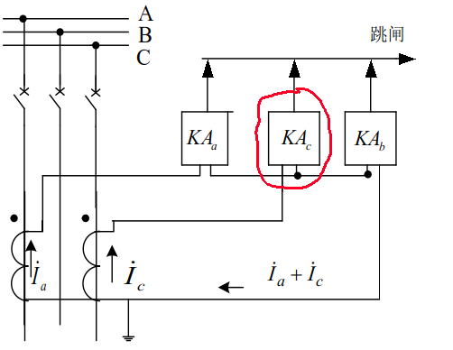

## 第二章 电网的电流保护和方向性电流保护

### 2.1 电流速断保护 I 段

- **最大运行方式：**对每一套保护装置来讲，通过该保护装置的短路电流为最大的方式。

  **最小运行方式：**对每一套保护装置来讲，通过该保护装置的短路电流为最小的方式。

- 为了保护的选择性，**动作电流按躲过本线路末端短路时的最大短路电流整定**

- **保护装置的动作电流：**能使该保护装置起动的最小电流值，用电力系统一次侧参数表示。

- **中间继电器的作用：**

  - 触点容量大，可直接接 TQ 去跳闸
  - 当线路上装有管型避雷器时，利用其固有动作时间（60ms）防止避雷器放电时保护误动

### 2.2 限时电流速断保护（第 Ⅱ 段）

- **要求：**

  （1）任何情况下能保护线路全长，并具有足够的灵敏性

  （2）在满足要求（1）的前提下，力求动作时限最小。

- 为保证选择性及最小动作时限，首先考虑其保护范围不超出下一条线路第 Ⅰ 段的保护范围。即**整定值与相邻线路 Ⅰ 段配合。**

### 2.3 定时限过电流保护（第 Ⅲ 段）

- **作用：**
  - 作为本线路主保护的近后备以及相邻线下一线路保护的远后备。
  - 其起动电流按躲最大负荷电流来整定不仅能保护本线路全长，且能保护相邻线路的全长。
- **动作电流的整定**
  - 躲最大负荷电流
  - 在外部故障切除后，电动机自起动时，应可靠返回。 电动机自起动电流要大于它正常工作电流，因此引入自起动系数  $K_{zq}$

### 2.4 三段式电流保护评价

- **选择性：**在单测电源辐射网中，有较好的选择性（靠 $I_{dZ}$ 、 $t$ ），但在多电源或单电源环网等复杂网络中可能无法保证选择性。

- **灵敏性：**受运行方式的影响大，往往满足不了要求。**——电流保护的缺点**

  第 Ⅰ 段：运行方式变化较大且线路较短，可能失去保护范围；

  第 Ⅲ 段：长线路重负荷（ $I_f$ 增大， $I_d$ 减小），灵敏性不满足要求。

- **速动性：**第 Ⅰ 、 Ⅱ 段满足；第 Ⅲ 段越靠近电源，t越长。**——缺点**

- **可靠性：**线路越简单，可靠性越高。**——优点**

- **应用范围：**   35KV 及以下的单电源辐射状网络中；第 Ⅰ 段： 110KV 等，辅助保护

### 2.5 电流保护接线方式

- 定义：指保护中**电流继电器**与**电流互感器二次线圈**之间的连接方式。
- 常用接线方式：
  - 三相星型接线
  - 两相星型接线

- 两种接线方式的比较：

  　　对各种相间短路，两种接线方式均能正确反映。在小接地电流系统中，在不同线路的不同相上发生两点接地时，一般只要求切除一个接地点，而**允许带一个接地点继续运行一段时间。**

  - 三相星型接线灵敏度是两相星型接线的两倍

    **解决方法：**

    

  - 经济性：两相星型接线优于三相星型接线

  - 应用场景：

    - 三相星型接线：发电机、变压器等（要求较高的可靠性和灵敏性）。
    - 两相星型接线：中性点直接接地电网和非直接接地电网中。

### 2.6 功率方向继电器

- 双电源多电源供电的问题：反方向故障时对侧电源提供的短路电流引起误动。

  解决方法：加装方向元件——**功率方向继电器**

- 原理：利用判别短路功率方向或电流、电压之间的相位关系，就可以判别发生故障的方向。

- **基本要求：**

  - 有明确的方向性
  - 故障时可靠动作并有足够灵敏度

- 最大灵敏角：在 $U_J$ 、 $I_J$ 幅值不变时，其输出（转矩或电压）值随两者之间的相位差的大小而改变。当输出为最大时的相位差称**最大灵敏角。**

- **消除电压死区**的方法：采用 $90^{\circ}$ 接线方式，加记忆回路。

  $90^{\circ}$ 接线方式：指系统三相对称且 $cos\varphi=1$ 时， $arg\frac{\dot{I}_J}{\dot{U}_J}=90^{\circ}$ 的接线方式。

- 功率方向继电器**优点**：

  - 对各种两相短路都没有死区；
  - 适当选择内角后，对线路上各种相间故障保证动作的方向性；

- 功率方向继电器**缺点：**

  出口三相相间短路存在电压死区问题。

**如果保护定值大于反方向短路的最大电流，则不需要安装方向元件**

- 方向性电流保护的评价：

  - 在多电源网络及单电源环网中能保证选择性

  - 快速性和灵敏性同前述单侧电源网络的电流保护

  - 接线较复杂，可靠性稍差，且增加投资

  - 出口时， GJ 有死区，使保护有死区　**——缺点**

    **力求不用方向元件**（如果用动作电流和延时能保证选择性）

### 2.7 零序电流保护

- 输电线路的接地保护

  - 大接地电流系统：系统中主变压器中性点直接接地

    在此系统中,当发生接地故障时,通过变压器接地点构成短路通路,使故障相流过很大的短路电流

  -  110KV 及以上电网——中性点直接接地系统

     60KV 及以上电网——中性点不接地或不直接接地系统

- **三段式保护（或四段式）**

  I 段：速动段保护（*灵敏性的要求与 I 段电流保护相同 $\geqslant(15\%\sim20\%)$* )

  II 段（或 III 段）：有选择性地切除本线路范围的接地故障，其动作时间应尽量缩短。

  最末一段：后备保护

  *三段式零序电流保护原理与三段式电流保护相似*

- 零序电流保护的评价

  - 优点：

    1. 零序电流保护更灵敏

       I 、II 受运行方式影响较小，I 段保护范围长且稳定，II 段灵敏性易于满足

       III 段躲不平衡电流，定值低更灵敏且时间较短

    2. GT0 出口无死区，接线简单、经济、可靠

    3. 系统振荡、短时过负荷等情况下（三相对称） $I_0$ 不受影响

  - 缺点：不能反映相间短路故障
