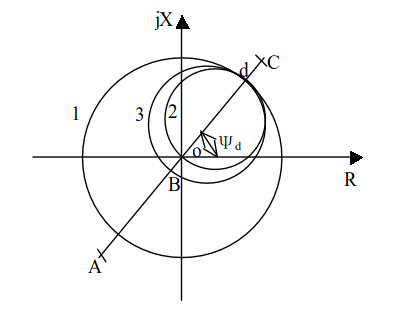

## 第三章 电网的距离保护

### 3.1 距离保护的作用原理

- 电流保护的**优点：**简单、可靠、经济

  **缺点：**选择性、灵敏性、快速性很难满足要求（尤其 35KV 以上的系统）。

  **距离保护性能比电流保护更完善**

- 距离保护不受系统运行方式变化的影响

- 距离保护分为三段式：

  - I 段：$$Z^I_{dz1}=(0.8\sim0.85)Z_{AB}$$ ，瞬时动作。——主保护
  - II 段：$$Z^{II}_{dz1}=K^{II}_K(Z_{AB}+Z^I_{dz2})$$ ，$$t=0.5^{''}$$ 。——主保护
  - III 段：躲最小负荷阻抗，阶梯时限特性。——后备保护

 

### 3.2 阻抗继电器

- 按构成分为两种：单相式和多相式

  **单相式阻抗继电器：**指加入继电器的只有一个电压 $$U_J$$ （相电压或线电压）和一个电流 $$I_J$$ （相电流或两相电流之差）的阻抗继电器。它只能反映一定相别的故障，故需多个继电器反映不同相别故障。

  **多相补偿式阻抗继电器：**加入的是几个相的补偿后的电压。它能反映多相故障，但不能利用测量阻抗的概念来分析它的特性。

- 阻抗继电器的动作特性
  $$
  Z_J=\frac{\dot{U}_J}{\dot{I}_J}=\frac{\frac{\dot{U}_1}{n_{PT}}}{\frac{\dot{I}_1}{n_l}}=\frac{\dot{U}_1}{\dot{I}_1}\times\frac{n_l}{n_{PT}}=Z_d\times\frac{n_l}{n_{PT}}
  $$
  

  
  

  圆 1 ：以od为半径——全阻抗继电器（反方向故障时，会误动，没有方向性）

  圆 2 ：以od为直径——方向阻抗继电器（本身具有方向性）

  圆 3 ：偏移特性继电器

- 三种阻抗的意义

  - 测量阻抗 $$Z_J$$ ：由加入继电器的电压 $$U_J$$ 与电流 $$I_J$$ 的比值确定。
  - 整定阻抗 $$Z_{zd}$$ ：一般取继电器安装点到保护范围末端的线路阻抗。
  - 起动阻抗（动作阻抗） $$Z_{dz.J}$$ ：它表示当继电器刚好动作时，加入继电器的电压 $$U_J$$ 和电流 $$I_J$$ 的比值。

  除全阻抗继电器以外： $$Z_{dz.J}$$ 随 $$\psi_J$$ 的不同而改变。当 $$\psi_J=\psi_{lm}$$ 时， $$Z_{dz.J}=Z_{zd}$$ ，此时最大。

- 阻抗继电器的接线方式

  - 要求 $$Z_J$$ 正比于 $$I_d$$ ，且与故障类型无关。
  - 接线方式：$$0^{\circ}$$ 接线、$$30^{\circ}$$ 接线、$$-30^{\circ}$$ 接线

### 3.3 方向阻抗继电器特性分析

- 方向阻抗继电器的**死区**

  **产生原因：**

  在保护正方向出口发生相间短路时， $$U_J=0$$ ，方向阻抗继电器不动作。

  幅值比较方式：两个电压相等；
$$
\left|\dot{U}_J-\frac{1}{2}\dot{I}_JZ_{zd}\right|\leqslant\left|\frac{1}{2}\dot{I}_JZ_{zd}\right|
$$
　相位比较方式：极化电压为 0 ，失去比相的据。
$$
-90^{\circ}\leqslant arg\frac{\dot{U}_J}{\dot{I}_JZ_{zd}-\dot{U}_J}\leqslant90^{\circ}
$$

- **消除电压死区的方法：**

  - **引入极化电压 $$U_P$$** ，要求：
    1. 与 $$U_J$$ 同相位；
    2. 出口短路时， $$U_P$$ 应具有足够的数值或能保持一段时间逐渐衰减到零。

  - **获取极化电压的方法：**
    1. **采用电压记忆回路**

       输入电压 $$U_P$$ 经工频 LC 串联谐振电路后产生工频谐振电流 $$I_u$$ ，取 $$U_R=I_u\cdot R$$ 为极化电压。

    2. **高 Q 值 50Hz 带通有源滤波器**

       在集成电路保护中，利用滤波器响应特性的时间延迟， Q 值越高，延迟时间越长，可达到记忆 4－5 个周波的要求。

    3. **引入非故障相（健全相）电压**

       - 对于保护出口两相短路，两故障相的相间测量电压为零，而非故障相间的电压仍然很高。直接利用或部分利用非故障相的电压来消除两相短路的电压死区。
       - 对第三相（健全相）电压进行适当的相移，使其输出电压与输入电压 $$U_J$$ 同相，作为辅助极化电压。
       - 不能消除出口三相短路的电压死区
       - 一般与电压记忆回路同时采用

- 极化回路记忆作用对继电器动作特性的影响
  - 当采用记忆回路后，极化电压将短时记忆短路前负荷状态厂母线电压
  - 保护正方向短路时，在记忆回路作用下的动态特性圆，扩大了动作范围，而又不失去方向性，因此，对消除死区和减小过渡电阻的影响都是有利的。

### 3.4 对距离保护的评价

1. **选择性**

   在多电源的复杂网络中能保证动作的选择性。

2. **快速性**

   距离I段能保护线路全长的 85% ；对双侧电源的线路，至少有 30% 的范围保护要以 II 段时间切除故障。

3. **灵敏性**

   同时反应电压和电流，灵敏度比单一反应电流的保护高。距离I段的保护范围不受运行方式变化的影响。第 II 、 III 段的保护范围受运行方式变化影响较小。

4. **可靠性**

   由于阻抗继电器构成复杂，距离保护的直流回路多，振荡闭锁、断线闭锁等使接线复杂，可靠性较电流保护低。

5. 应用：

   在 35KV~110KV 作为相间短路的主保护和后备保护，采用带零序电流补偿的接线方式，在 110KV 线路中也可作为接地故障的保护。

   在 220KV 线路中作为后备保护。

### 3.5 短路点过渡电阻的影响及相应措施  

见**讨论课思考题 2** 

### 3.6 电力系统震荡对距离保护的影响

　　振荡时，系统中各发电机电势间的相角差随时间作周期性变化，从而使系统中各点电压、电流和功率的幅值和相位周期性变化，距离保护的测量阻抗也将发生周期性变化，可能导致距离保护误动。但通常系统振荡若干周期后，多数情况下能自行恢复同步，若此时保护误动，势必造成不良后果，因而是不允许的。

- 解决方法：**震荡闭锁回路**
  - 要求：当系统只发生振荡而无故障时，应可靠闭锁保护；
    - 区外故障而引起系统振荡时，应可靠闭锁保护
    - 区内故障，不论系统是否振荡，都不应闭锁保护
  - 振荡闭锁回路目前主要采用两种原理：
    - 利用短路时出现负序分量而振荡时无负序分量原理
    - 利用振荡和短路时电气量变化速度不同的原理
